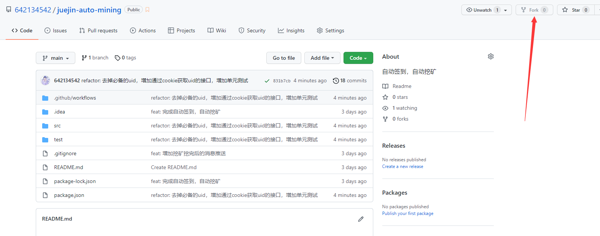
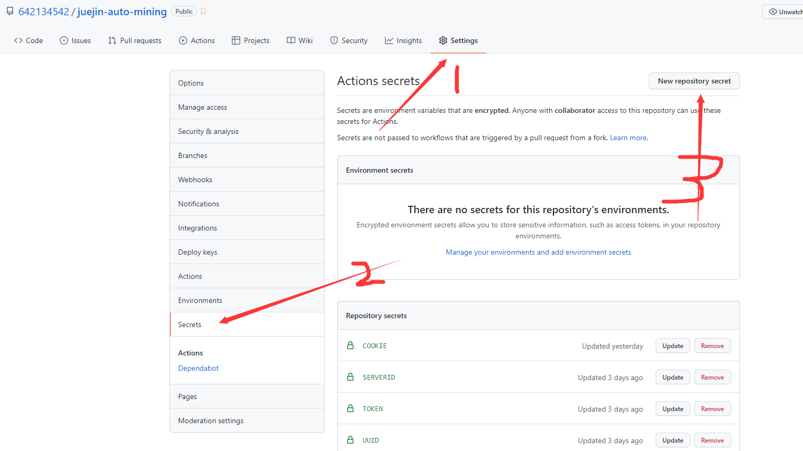
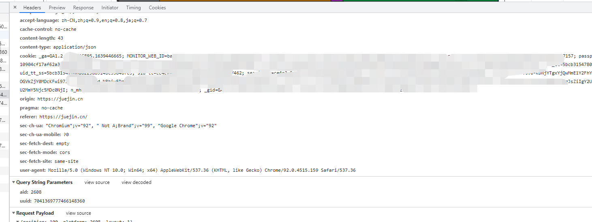
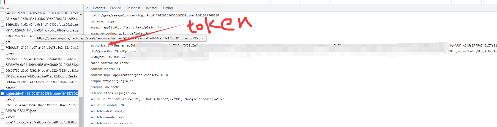
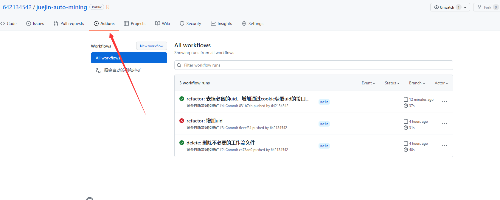
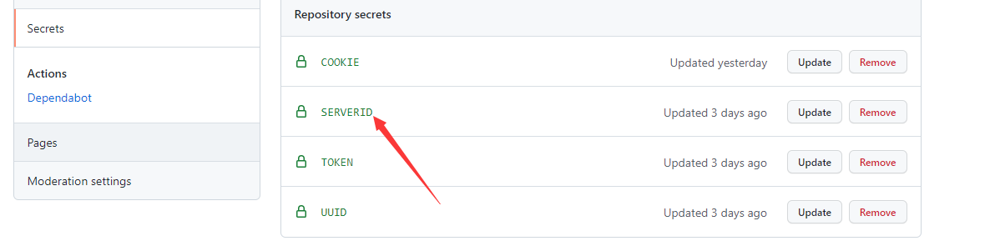

# juejin-auto-mining
本项目使用`Github Action`来部署自动签到程序和自动挖矿，无需自己购买服务器，安全可靠且方便。

## 使用方式

###  1.fork本项目

### 2.依次点击【Setting】、【Secrets】、【New repository secret】

### 3.把 Name 设置为`COOKIE`这个字符串，Value 设置为`自己掘金的Cookie`

### 4. 设置TOKEN

需要到海底掘金的页面查看

### 5.允许 Github Actions 工作流。

### 6.消息通知

#### server酱

依次点击【Setting】、【Secrets】、【New repository secret】，添加SERVERID的名称和值即可

